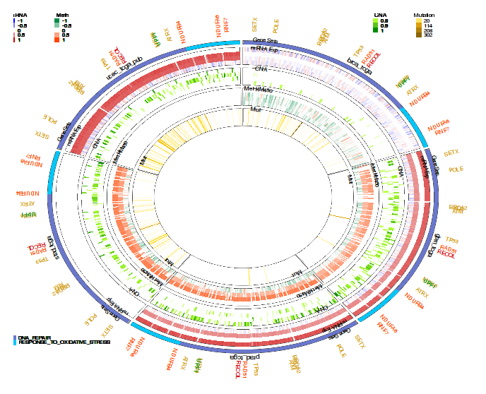
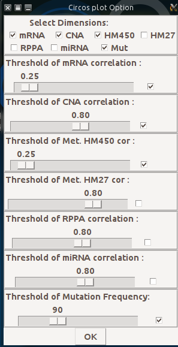

# A Graphical User Interface for accessing and modeling the Cancer Genomics Data of MSKCC.

 

The package is user friendly interface based on the cgdsr and other modeling packages to explore, compare, and analyse all available Cancer Data (Clinical data, Gene Mutation, Gene Methylation, Gene Expression, Protein Phosphorylation, Copy Number Alteration) hosted by the Computational Biology Center at Memorial-Sloan-Kettering Cancer Center (MSKCC).

Circular layout is an interesting way to integrate multi-omics heterogeneous  and big data of cancer disease in the same plot. The goal is to make easy the interpretation and the exploring of the relationships between cancers, genes or dimensions.
There are two R packages (RCircos and Circlize) available for Circular layout but its use remain laborious and needs computational skills.
CanceR package implements "getCircos" function to facilitate the visualization of cancer disease using Circos style. User needs only to select cancers and check which dimensions will be plotted.

User can select a simple gene list from files or examples or can focus on gene list from gene sets selected from MSigDB.
In the following case I  focus my exploring to two gene lists corresponding to gene set involved in DNA repair and Response to oxidative stress. canceR package allows user to select any gene sets from MSigDB without gene duplication.

I selected mRNA (0.3 threshold), CNA (0.85), Met HM450 (0.3), Mutation (Frequency 101). Only genes with significant rates are plotted with corresponding colors. For example Gold for mutation, Orange (Methylation), Green (CNA), red (mRNA expression).

I selected 5 cancers represented with 5 sectors. In the same sector there are 7 tracks (layouts) corresponding respectively (out : in) to: Gene List, Gene Sets, mRNA, CNA, Methylation, Mutation

