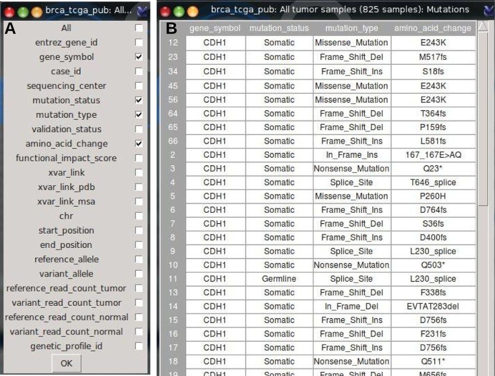
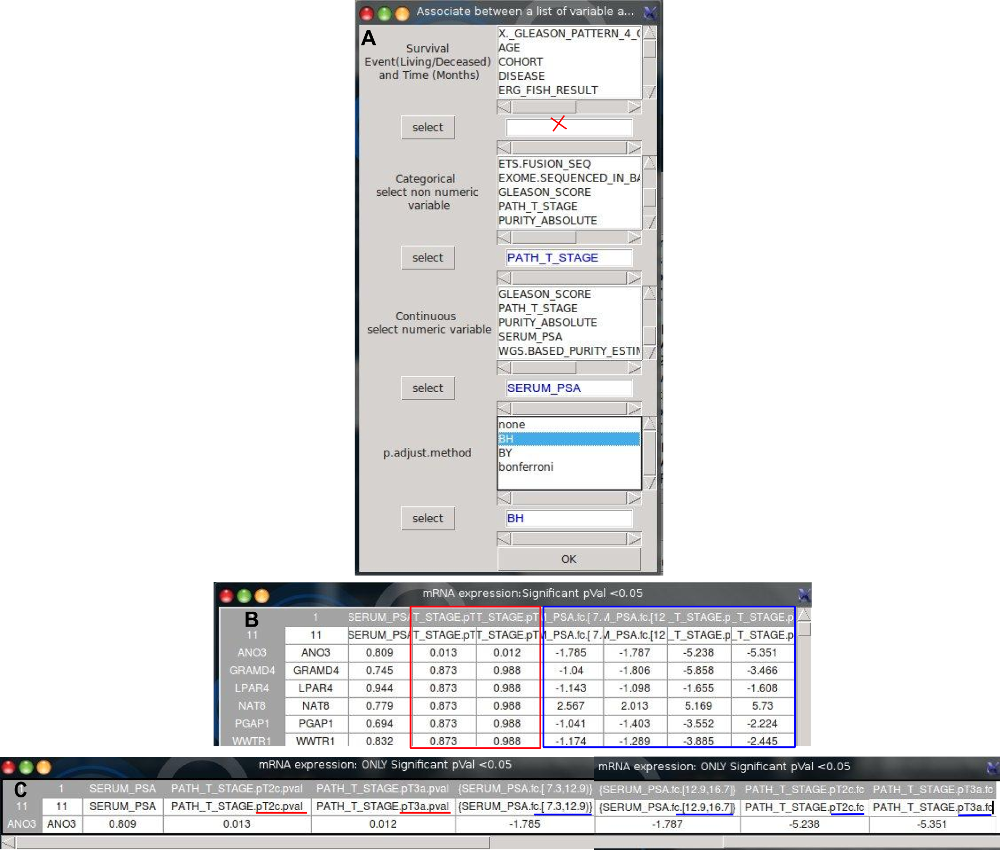
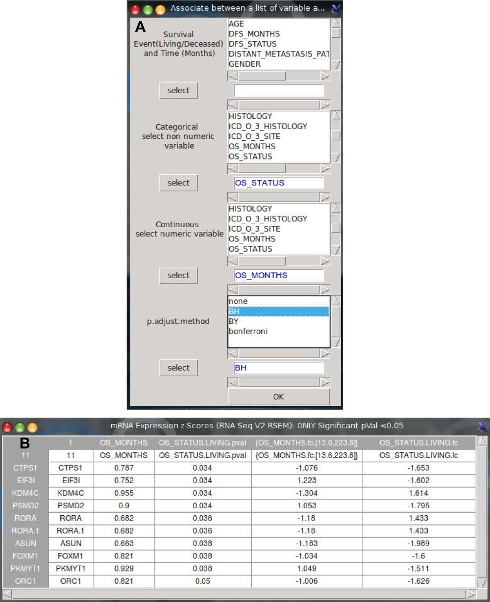

```{r style, echo=FALSE, results="asis", message=FALSE}
knitr::opts_chunk$set(tidy = FALSE,
                      warning = FALSE,
                      message = FALSE)
```

# Introduction

`canceR` is  a graphical user friendly interface to explore, compare, and analyse all available Cancer Data (Clinical data, Gene Mutation, Gene Methylation, Gene Expression, Protein Phosphorylation, Copy Number Alteration) hosted by the Computational Biology Center (cBio) at Memorial-Sloan-Kettering Cancer Center (MSKCC). `canceR` implements functions from various packages:
1. to acces, explore and extract Genomics Cancers Data Base of MSKCC (`cgdsr`,[@Cerami2012,@Gao2013]),

2. to associate phenotypes with gene expression (`phenoTest`, [@Planet2013]),

3. to predict which biological process or pathway or immune system are significantly different under the phenotypes and which genes are associated (`GSEA-R`~[Subramanian2005,Subramanian2007]),

4. to predict the most up/down regulated gene sets belonging to one of MSigDB collections~[Subramanian2005] (`GSEAlm`,[@Oron2008]),

5. to classify genes by diseases (`geNetClassifier`,[@Aibar2013]), or

6. to classify genes by variable or phenotype (`rpart`, [@Therneau2014]),

7. to plot genes correlations.

8. to plot survival curves

9. to plot muti-omics data using Circos style (`circlize`, [@Gu2014])


# Installation


## Suplementary librairies (Not R packages)

* ktable http://tktable.sourceforge.net/

* Widget http://sourceforge.net/projects/tcllib/files/BWidget/

* nuWin32 (for Windows) http://sourceforge.net/projects/getgnuwin32/?source=typ_redirect


For Debian distribution (GNU/Linux)

```{r eval = FALSE}
sudo apt-get insall ("r-cran-tcltk2","r-cran-tkrplot")
sudo apt-get install(Tk-table, BWidget)
sudo apt-get install libcurl4-openssl-dev
sudo apt-get install r-cran-xml
```

For Windows distribution

[LibXml2](http://sourceforge.net/projects/gnuwin32/files/): parser for XML 

For OS X distribution [XQuartz](https://www.xquartz.org/): graphics device

run R and write theses lines in console to install dependencies.

```{r eval=FALSE}
install.packages("RCurl", "XML")
install.packages(c("cgdsr","tkrplot","Formula","RCurl" ))
```

##  dependencies from Bioconductor

```{r eval=FALSE}
library(biocManager)
biocManegr::install("GSEABase", "GSEAlm","geNetClassifier","Biobase", "phenoTest")
BiocManager::install("canceR")
```

Get the development version from github
```{r eval=FALSE}
library(devtools)
devtools::install_git("kmezhoud/canceR")
```

# Starting Window
run R and write theses lines in console to run canceR package.

```{r eval=FALSE}
library(canceR)
canceR()
```

The starting window (Figure~\@ref(fig:starting.png)-1) loads all available Cancer Studies (Figure~\@ref(fig:starting.png)-3) or search some ones by keyword (Figure 1 4). Before to get Cancers Data (Figure 1 7), it is important to set workspace for output files (Figure~\@ref(fig:starting.png)-1). The starting window displays Help menu where user can get this vignette (Figure~\@ref(fig:starting.png)-2).


## Setting Workspace

canceR package uses input files to compute models and generates output files for biological knowledges. It is important to set workspace and know the location of used files and results. The Button `Set Workspace` allows user to set easily workspace (Figure~\@ref(fig:setWorkspace.jpeg)). User needs just to browse workspace folder or creates a new one. The others necessary folders would be created by simple pressing `Set` buttons.


# Main Window

After selecting studies and pressing on `Get Cases and Genetic Profiles` Button, the main window appears (Figure~\@ref(fig:mainWindow.png)) and displays the progress of loading data of selected studies. The Main Window has a Toolbar with Menus (see following paragraphs). It is subdivised in two columns. The first column lists Cases for all selected studies. The first line of every study indicates its Index and its short description. The remain lines enumerate Cases with short description of data type and the number of samples. The second list box shows selected Cases. Similarly, the second column displays informations of Genetic Profiles.
User can select a single or multiple lines with attention to correspond the Case with appropriate Genetic Profile.


## Gene List

The first step to get genomics data is to specify what are interesting genes for user. The Gene List button browses folders to load Gene list file or displays examples of genes list. The genes could be in text file (.txt) with one gene by line using HUGO gene Symbol. The function removes automatically duplicate genes.

## Clinical Data

The Multiple Cases button displays successively selected Cases. Results are returned in a table with row for each case and a column for each clinical attribute (Figure 4B). User could select all or some clinical data by checking dialog box (Figure 4A). For example, we select clinical attributes:

* Overall Survival months: Overall survival, in months.

* Overall Survival Status: Overall survival status, usually indicated as `LIVING` or `DECEASED`.

* Disease Free Survival months: Disease free survival, in months.

* Disease Free Survival status: Disease free survival status, usually indicated as `DiseaseFree` or `Recurred/Progressed`.

* Age at diagnosis: Age at diagnosis.


## Mutation

User can search all mutation in gene list of all selected studies. He needs to select All tumors samples in Cases and Mutations in gentics profiles to get mutations (Figure~\@ref(fig:Mutation1.png)).


Mutation function allows user to select about 15 informations corresponding to mutations (Figure~\@ref(fig:Mutation)A). The results is a table with rows for each sample/case, and columns corresponding to the informations cheched in dialog mutation check box (Figure~\@ref(fig:Mutation)B).




User can filter mutation result only for specific amino acid change (Figure~\@ref(fig:specificMutation.png)).


## Methylation
User can search gene methylation and its correlation with mRNA expression. User needs to select Cases and Genetic Profiles with same methylation assay (HM450 or HM27) for the same study. Multiple Cases selection is allowed for one gene list (Figure~\@ref(fig:methylation.png)).


The dialog box of `methylation` function allows user to specify the threshold of the correlation rate (Figure~\@ref(fig:Met_rate)A). cBioportal~[@Cerami2012,@Gao2013] includes only methylation data from the probe with the strongest negative correlation between the methylation signal and the gene's expression. The result table (Figure~\@ref(fig:Met_rate)B) lists genes with median of rate upper than 0.8.


## Profiles

The function get Profile Data depends on gene list, cases, and genetic profiles. If a `Single gene` option is done, dialog box appears to specify gene symbol (Figure~\@ref(fig:singleProfile.png)). The returned dialog check box allows user to choose some/all profiles data (Figure~\@ref(fig:singleProfile.png)B). The result (table) lists some/all genetic profiles data in columns (CNA, Met, Mut, mRNA,RPPA) and all available samples in rows (Figure~\@ref(fig:singleProfile.png)C). Oppositely, if `Multiple genes` option is done, the returned table displays genes expression for gene list (column) for all samples (rows). In the case of multiple genes, the tables are saved in `Results/ProfilesData` folder (Figure~\@ref(fig:multipleProfiles.png)).


## PhenoTest

The function was implemented from package `PhenoTest`~[@Planet2013]. The object of this function is to predict the association between a list of phenotype variables (Survival, DFS~Status, OS~Status) and the gene expression. There are two possible formula to get associations:

1. Three variables: `Survival` status (event/time as Dead-Living / 30 Months), `Categorical` or `ordinal` description (DSF~STATUS or Tumor stage), and `Continuous` value (DFS~MONTHS, Tumor size).
2. Two variables:  `Categorical` or `ordinal` description (DSF~STATUS or Tumor stage), and `Continuous` value (DFS~MONTHS, Tumor size). In this case user does not need to select any variables for survival variable in the phenoTest dialog box (Figure~\@ref(fig:prad_broad-2013Results.png)A).


The output of this function does not expect to give  systematically  a relevant association between all formula of the chosen variables, although in some cases it  is possible to cluster a list of  genes significantly regulated (gene expression) at a range of tumor size (continuous)  or tumoral stage (ordinal) for recurred or DiseaseFree cases (survival and categorical). 
The type of variables could be explored with Clinical Data tables and selected in the phenoTest dialog box (Figure~\@ref(fig:prad_broad-2013Results.png) A), Dialog Boxused to select variables; B, Results; C, Only significant pValues}A). The effect of both `continuous`, `categorical` and `ordinal` phenotype variables on gene expression levels are tested via `lmFit` from `limma` package~[@Wettenhall2004]. Gene expression effects on `survival` are tested via Cox proportional hazards model~[@Cox1972], as implemented in function `coxph` from `survival` package.

* NB: Continuous or Categories can not have more than 4 classes.

### Examples

**Study: Prostate Adenocarcinoma (Broad/Cornal, Call 2013)**

* Cases: All tumor samples (57 samples),

* Genetic Profiles: mRNA expression,

* Gene list: 1021.txt file

* Survival variable: empty

* Categorical variable: Pathology Tumor Stage

* Numeric variable: Serum PSA level

* pVal adjust method: BH

* `PhenoTest` with Two variables (Figure~\@ref(fig:prad_broad-2013Results.png)


After running `Pheno/Exp`, `PhenoTest` function returns two tables. The first table ranks gene list by `pval` (Figure~\@ref(fig:prad_broad-2013Results.png)B). The first part (red square) displays pValues of the association between gene expression and Tumor stage. The second part (blue square) displays the fold change (fc) by PSA level rang.\\

**Interpretation:** Notice that a single pValue is reported for each phenotype variable. For categorical variables these corresponds to the overall null hypothesis that there are no differences between groups.


In the second table, *PhenoTest* function filters only gene that has significant pval (pval <0.05, Figure~\@ref(fig:prad_broad-2013Results.png)C red). Here we see that tumor stage has been categorized into 2 groups (pT2c, pT3c) and PSA level has been ranged into 2 groups (7.3-12.9, 12.9-16.7). This results shows that *ANO3* gene is significantly down regulated (negative fold change) for the two pathology tumor stages (pT2c, pT3c).





**Heteroneous Clinical Data**

In some cases it is possible to have digital (0-9) and character (a-z) data  in the same variable. in this case phenoTest function considers it as Categorical variable~(Figure~\@ref(fig:heterogeneous1.jpeg)).


**Study: Prostate Adenocarcinoma, Metastatic (Michigan, Nature 2012)**

* Cases: All tumor samples (61 samples),
* Genetic Profiles: mRNA expression 

* Gene list: 1021.txt file

* Survival variable: OS MONTHS, OS STATUS

* Categorical variable: OS STATUS

* Numeric variable: Serum PSA level

* pVal adjust method: BH

* `PhenoTest` with three variables (Figure~\@ref(fig:prad_MichiganResults.png) )

In This test, Overall Survival (OS_STATUS) was used in survival and caterogical variables. The Clinical Data does not have enougth categorical variables. Figure~\@ref(fig:prad_MichiganResults.png) B and C shows signicant association between 7 genes and Living Status (OS_STATUS.Living.pval column). The two last columns show opposite regulation of the 7 genes expression in living patient with serum PSA level. The Cox proportion hazard model does not give results with survival variables (OS_STATUS column).


**Study:Lung Adenocarcinoma (TCGA, Nature, in press)**

* Cases: All Samples with mRNA expression data (230 samples),

* Genetic Profiles: mRNA expression z-Scores (RNA Seq V2 RSEM)

* Gene list: 1021.txt file

* Survival variable: empty

* Categorical variable: OS STATUS

* Numeric variable: OS\_MONTHS

* pVal adjust method: BH

* PhenoTest with two variables.


In this Lung cancer Study, the test shows significant association between living patient and 10 genes expression (Figure~\@ref(fig:LungNatureResults.png)).




## GSEA-R

Gene Set Enrichment Analysis (GSEA) is computational method that uses expression matrix of thousands of genes with phenotypes data (two biological states) and Molecular Signatures DataBase (MSigDB) to define which biological process or pathway or immune system are significantly different under the phenotypes and which genes are associated~[@Subramanian2005]. 

### Preprocessing of Exprimental Data

`getGCT_CLS` function loads Profile and Clinical data  of selected study and saves two files into "gct_cls" folder (Figure~\@ref(fig:gct_cls.png)C).

* The GCT file contents genes expression values with genes in the rows and samples in the columns.

* The CLS file contents the two biological phenotypes selected from Clincical data. User needs to select clinical phenotype only with two classes.


## Molecular Signatures DataBase

The Molecular Signatures DataBase (MSigDB) is a collection of annotated gene sets for use with GSEA computational method. The MSigDB gene sets are divided into 7 collections (positional gene sets, curated gene sets, motif gene sets, computational gene sets, GO gene sets, oncogenic signatures, and immunological signatures). All these collections are available at [Broad Institute ](http://www.broadinstitute.org/gsea/msigdb/index.jsp). Every collections consists in a tab delimited file format (.GMT file) that describes gene sets. Each row shows annotation terme with associated genes. 
User needs to download .gmt file with genes Symbols and saves them into "workspace/MSigDB/" folder. The MSigDB folder is created with the file menu in the starting windows~(Figure~\@ref(fig:starting.png)).

For more detail about `GCT, CLS, GMT` files, see this [link](http://www.broadinstitute.org/cancer/software/gsea/wiki/index.php/Data_formats).


### MSigDB Collection

* C1: Positional Gene Sets Gene sets corresponding to each human chromosome and each cytogenetic band that has at least one gene. These gene sets are helpful in identifying effects related to chromosomal deletions or amplification, epigenetic silencing, and other region effects.

* C2: Curated Gene Sets into Pathways Gene sets collected from various sources such as online pathway databases.

    * CGP: Chemical and Genetic Perturbation - Gene sets represent expression signatures of genetic and chemical perturbations. 
    * CP: Reactome gene sets - Gene sets derived from the Reactome pathway database.

* C3: Motifs Gene Sets Gene sets that contain genes that share:

    * MIR: microRNA targets A 3'-UTR microRNA binding motif.
    
    * TFT: tanscription factor targets A transcription factor binding site defined in the TRANSFAC ([version 7.4(http://www.gene-regulation.com/) database. 
    
* C4: Computational Gene Sets Computational gene sets defined by mining large collections of cancer-oriented microarray data. 

* C5: GO Gene Sets Gene sets are named by GO term ([GO](http://geneontology.org/) and contain genes annotated by that term: Biological Process, Cellular Component, and Molecular Function.

* C6: Oncogenic Signatures Gene sets represent signatures of cellular pathways which are often dis-regulated in cancer. The majority of signatures were generated directly from microarray data from NCBI GEO.

* C7: Immunologic Signatures Gene sets that represent cell states and perturbations within the immune system. This resource is generated as part of the Human Immunology Project Consortium ([HIPC](http://www.immuneprofiling.org/)). 


#### Examples

##### Study: Uterine Corpus Endometrioid Carcinoma (TCGA, Nature 2013)

* Cases: All Samples with mRNA, CNA, and sequencing data (232 samples),

* Genetic Profiles: mRNA expression (RNA Seq V2 RSEM)

* MSigDB: c5.bp.v4.0.symbols

* Gene list: 1021.txt file

* Nbr of Samples: 100

* Phenotype: DFS_STATUS

Based only on Gene list the function `getGCT,CLS files` builts the `.gct` and `.cls` files and save them under the folder "/gct_cls/". The Figure~\@ref(fig:gct_cls.png) shows the pre-porcessing steps to get `gct` and `cls` files.


For enrichment, `GSEA` function needs three files. The `gct` file with gene expression, the `cls` with phenotypes and `gmt` file with Molecular signature of Gene Sets. There are two options to load `gmt` file, from examples (Figure~\@ref(fig:GSEA-R.png)A, MSigDB.gmt button) available into  `canceR` package or from "workspace/MSigDB/" folder (Figure~\@ref(fig:GSEA-R.png)A, browse button) . In the two ways the `gmt` files must be from [Broad Institute](http://www.broadinstitute.org/gsea/index.jsp) and has gene Symbols. 


![(#fig:GSEA-R.png) Gene Set Enrichment Analysis of Uterine Corpus Endometrioid Carcinoma study using "DiseaseFree/Recurred" phenotypes. A, Selecting cls, gmt, gmt files ans setting output folder; B, Specifying the phenotype; C, displying the classes of the selected phenotype; D, Selecting Summary results files of the output and setting FDR; E, displying specific (FDR=0.25) Gene Sets (GS) involved in DiseaseFree phenotype. In this GSEA there is not significant GS involved specifically for Recurred phenotype.](image/GSEA-R.png)

 
### Study: Breast Invasive Carcinoma (TCGA, Provosional)

* Cases: All Samples with mRNA expression data (562 samples),
 
* Genetic Profiles: mRNA expression (RNA Seq V2 RSEM)

* MSigDB: c5.bp.v4.0.symbols

* Gene list: 1021.txt file

* Nbr of Samples: 100

* Phenotype: OS_STATUS
 
The Figure~\@ref(fig:figbreastGSEA) summarizes the gene sets enrichment analysis of Breast Invasive Carcinoma study using "Deceased/living" phenotypes. The Figure~\r@ef(fig:figbreastGSEA)C shows 4 vs 1 biological process involved respectively  into Deceased/Living phenotypes. The size and the genes of appropriate GS are indicated in the second (size) and third (source) columns. The report of significant GS are saved into "/Results/GSEA/name_of_folder/". Every GS has a report (.txt file) indicating the gene list and which genes (CORE_ENRICHMENT column: YES) are involved in the specific phenotype (DECEASED for RESPONSE_To_STRESS). The plots of significant GS are save with .pdf format file.  In a heat map, expression values are represented as colors for every patient, where the range of colors (red, pink, light blue, dark blue) shows the range of expression values (high, moderate, low, lowest). For more details about result interpretation see user guide of [GSEA](http://www.
broadinstitute.org/gsea/doc/GSEAUserGuideFrame.html).


### GSEA-R Result Interpretation

The primary result of the gene set enrichment analysis is the enrichment score (ES), which reflects the degree to which a gene set is overrepresented at the top or bottom of a ranked list of genes. A positive value indicates correlation with the first phenotype and a negative value indicates correlation with the second phenotype.  For continuous phenotypes (time series or PSA level), a positive value indicates correlation with the phenotype profile and a negative value indicates no correlation or inverse correlation with the profile~[@Subramanian2005].

The number of enriched gene sets that are significant, as indicated by a false discovery rate (FDR) of less than 25\%. Typically, these are the gene sets most likely to generate interesting hypotheses and drive further research.

The number of enriched gene sets with a nominal p-value of less than 1\% and of less than 5\%. The nominal p-value is not adjusted for gene set size or multiple hypothesis testing; therefore, it is of limited value for comparing gene sets.

The false discovery rate (FDR) is the estimated probability that a gene set with a given NES represents a false positive finding. For example, an FDR of 25\% indicates that the result is likely to be valid 3 out of 4 times. The GSEA analysis report highlights enrichment gene sets with an FDR of less than 25\% as those most likely to generate interesting hypotheses and drive further research, but provides analysis results for all analyzed gene sets. In general, given the lack of coherence in most expression datasets and the relatively small number of gene sets being analyzed, an FDR cutoff of 25\% is appropriate. However, if you have a small number of samples and use geneset permutation (rather than phenotype permutation) for your analysis, you are using a less stringent assessment of significance and would then want to use a more stringent FDR cutoff, such as 5\%~[@Subramanian2005].

 
#### Resolved limits

* GSEA does not accept negative values from Profile data. In this case the adding of absolute of less negative value to all the matrix is done.

* GSEA does not accept missing value in \texttt{cls} file. The sampling is done only on existing phenotype information.

* GSEA needs more than 10000 to be robust but url/gcds-r package accept less that 1000 genes.

* The size of samples is between 50 and 100

* Removing and cleaning the heterogeneity of the data frames of gene expression: space, character, empty boxes and convert them to readable form by GSEA-R function.


## Linear Modeling of GSEA (GSEAlm)

GSEAlm is a function implemented from GSEAlm package~[@Oron2008]. `GSEAlm` function is a Linear Model inference and diagnostics for Gene Set Enrichment Analysis. It uses mRNA expression matrix of gene list, variable(s) from clinical data (phenotype) and Molecular Signature Data Base (MSigDB) that groups genes sharing common biological function, chromosomal location,  pathway or regulation~[@Subramanian2005].  The result is a prediction of the most up/down regulated gene sets belonging to one of MSigDB collections~[@Subramanian2005, @Liberzon2011].

The linear model assumes that the mean of the response variable has a linear relationship with the explanatory variable(s). The data and the model are used to calculate a fitted value for each observation (gene expression). It is strongly recommended to use crude gene expression data and avoid z-score or standardized pre-processing data. we recommend to use the mRNA expression (RNA Seq V2 RSEM).

Two options are available to get linear model. In the first option (phenotypes into disease) the model predicts which gene sets are modulated between patients having the same disease and different phenotypes (OS_STATUS, DFS_STATUS). In the second option (disease vs disease) the model predicts which gene sets are modulated between patient having different disease.

The output is saved in `/Results/GSEAlm/selected-disease-name` folder. The names of output files describe their content.  Three files are saved by model. The pVal_MSigDB_GeneList_Disease.txt} file lists full results. The down/upRegulated_MSigDB_GeneList_Disease.txt} files filter only significant gene sets. The filtered result is merged in one table and  displayed in the screen.


#### Results interpretation:

* NA~~NA: The gene set is unrepresentative in the used gene list

* 1~~1: No significant different of mRNA expression between the two phenotypes


#### Limitations:

* Use categorical phenotype (not numeric) only with TWO classes

* Use crude and not normalised mRNA expression data

* The accuracy of the results is better with high number of genes (1000 - 10000) and 1000 permutations. This request takes a while to run. User is recommended to reduce the permutation to 100 instead 1000 and/or reduce the size of gene list.  

* If two or more phenotypes are checked, only the latter is taken.


### Which Molecular Signature Data base (MSigDB) for gene list

This function matches genes list with MSigDB files selected from example or directory (Figure~\@ref(fig:whichMSigDB)) and computes the mean of matched Genes by Gene Sets as:   


$$  Mean_{(Gene\in GeneSet)} = \frac{ \sum_{1,1}^{I,J} Gene_i \in GeneSet_j}{\sum_{1}^{I} Gene_i} $$

With I is the number of genes in the list and J is the number of Gene Sets in the MSigDB file. \\
The returned table indicates the mean of gene number that matched for every Gene Set. For example in the first row (Figure~\@ref(fig:whichMSigDB)), there are about 10 genes that mached for every Genes Set in c2.cp.reactome.v4.0.Symbol.gmt.


### get SubMSigDb for genes list

The SubMSigDb is a subset of MSigDB generated from gene list in the expression Set (eSet). This specific subsetting reduces the time of GSEA computing. User needs  to run before  eSet from phenoTest menu.


### GSEAlm: Phenotypes into Disease

#### Disease Free Status (DFS_STATUS) into Prostate Cancer:

* Study: Prostate Adenocarcinoma (TCGA, Provisional) 

* Cases: All Samples with mRNA expression data (246 samples),

* Genetic Profiles: mRNA expression (RNA Seq V2 RSEM)

* MSigDB: c2.cp.reactome.v4.0.symbols.gmt

* Gene list: 73.txt file

* Phenotype: DFS_STATUS

* Permutation: 1000

* pVal: 0.05
 
 

 
This example uses Reactome pathways gene sets (Figure~\@ref(fig:pradGSEAlm)A, (http://www.reactome.org/) to compare the gene expression of patients with reccured prostate disease versus patient with free prostate disease. The run was done with 1000 permuattion and pVal 0.05 (Figure~\@ref(fig:pradGSEAlm)B). The result (Figure~\@ref(fig:pradGSEAlm)C) shows only up regulated gene sets from Reactome pathways were observed in disease free patients. 
 
#### Copy Number Cluster Level into Stomach Adenocarcinoma:

* Study: Stomach Adenocarcinoma (TCGA, Nature 2014) 

* Cases: All Samples that have mRNA, CNA, and sequencing data (258 samples),

* Genetic Profiles: mRNA expression (RNA Seq V2 RSEM)

* MSigDB: c5.bp.reactome.v4.0.symbols.gmt

* Gene list: 73.txt file

* Phenotype: Copy_Number_Cluster (Low, High)

* Permutation: 1000

*  pVal: 0.05


 The losses and the gains of DNA can contribute to alterations in the expression of tumor suppressor genes and oncogenes. Therefore, the identification of DNA copy number alterations in tumor genomes may help to discover critical genes associated with cancers and, eventually, to improve therapeutic approaches. In this study we test GSEAlm algorithm with the level of the Copy Number cluster using Biological Process gene sets from Reactome. The Figure~\@ref(fig:stadGSEAlm)C shows significant down/up regulated gene sets in patients with low level compared to patients with high level of copy number cluster.
 
 


This finding suggests to repeat modeling with copy number alteration profile to predict which biological process (gene set) could be with low level of copy number cluster. The Figure~\@ref(fig:stadGSEAlmCNA)D lists gene sets with low level of copy number cluster in the case of stomach adenocarcinoma.


### GSEAlm: Disease vs Disease}

#### Breast vs Prostate Cancers:

In this function, the linear modeling uses the disease type as phenotype for the run. User needs to select two diseases and a gene list.

* Studies: Breast Invasive Carcinoma (TCGA, Provisional) versus Prostate Adenocarcinoma (TCGA, Provisional)

* Cases: All Samples with mRNA expression data (959/257 samples),

* Genetic Profiles: mRNA expression (RNA Seq V2 RSEM)

* MSigDB: c2.cp.reactome.v4.0.symbols.gmt

* Gene list: 73.txt file

* Phenotype: Diseases type

* Permutation: 1000

* pVal: 0.05

* Samples number: 50
 
 The Figure~\@ref(fig:brstprstGSEAlm) shows the results of the linear modeling.
 


## Genes Classification using mRNA expression (Classification)

The Classification menu displays two functions to rank genes by phenotypes into- and inter-diseases, depending on mRNA expression data.

### Genes vs Diseases (inter-diseases)

The first classifier is implemented from geNetClassifier package~[@Aibar2013]. It uses calculateGenesRanking function which based on Parametric Empirical Bayes method included in EBarrays package~[@Kendziorski2003]. This method implements an expectation-maximization (EM) algorithm for gene expression mixture models, which compares the patterns of differential expression across multiple conditions and provides a posterior probability. The posterior probability is calculated for each gene-class pair, and represents how much each gene differentiates a class from the other classes; being 1 the best value, and 0 the worst. In this way, the posterior probability allows to find the genes that show significant differential expression when comparing the samples of one class versus all the other samples (One-versus-Rest comparison)~[@Aibar2013].

In the following examples, we would like to predict specific modulated genes by cancer type. The features of the runs are:


#### Example 1: Breast vs Glioblastoma vs Liver vs Lung Cancers (Figure~\@ref(fig:GenesClass)A):}

* Studies:
  
  * Breast Invasive Carcinoma (TCGA, Provisional)
  
  * Glioblastoma Multiforme (TCGA, Provisional)
  
  * Liver Hepatocellular Carcinoma (TCGA, Provisional)
  
  *Lung Squamous Cell Carcinoma (TCGA, Provisional)

* Cases: All Samples with mRNA expression data,

* Genetic Profiles: mRNA expression (RNA Seq V2 RSEM)

* Samples: 50

* Gene list: 223.txt file

* lpThreshold: 0.95


The significant genes (dots)  are over the threshold of posterior probability (Figure~\@ref(fig:GenesClass)B, B'). Their number are listed in the legend. The details are displayed in table (Figure~\@ref(fig:GenesClass)C, C') and saved in /Results/Classifier folder.


#### Example 2: Bladder vs Breast vs Glioblastoma vs Lung vs Ovarian vs Prostate Cancers (Figure~\ref{GenesClass}A'):}

* Studies:
  
  * Bladder Urothelial Carcinoma(TCGA, Provisional)
  
  * Breast Invasive Carcinoma (TCGA, Provisional)
  
  * Glioblastoma Multiforme (TCGA, Provisional)
  
  * Lung Adenocarcinoma (TCGA, Provisional)
  
  * Ovarian Serous Cystadenocarcinoma (TCGA, Provisional)
  
  * Prostate Adenocarcinoma (TCGA, Provisional)

* Cases: All Samples with mRNA expression data,

* Genetic Profiles: mRNA expression (RNA Seq V2 RSEM)

* Samples: 50

* Gene list: 73.txt file

* lpThreshold: 0.95


### Genes vs Phenotypes (intra-disease)

The second function of genes classification is implemented from rpartpackage~[@Therneau2014]. The resulting models can be represented as binary trees with gene expression profile threshold (P53 > 2.56) is in node and classes (Living/Deceased) of selected variable in branch. The root of the tree is the best gene divisor of classes. The goal is to pedict which genes combination (P53> 2.56 + CAD < -0.45 + MDM4 > 1.92 lead to 80\% Diseased) could be split classes in two or more groups.
The tree is built by the following process: first the single variable is found which gene level splits the data into two groups. The data is separated, and then this process is applied separately to each sub-group, and so on recursively until the subgroups either reach a minimum size or until no improvement can be made~[@Therneau2014].

There are 3 methods of splitting rule : classification, anova, and Poisson.

The Classification used either Gini or log-likelihood function rules. It is used when there are only two categories into the selected variable. The dependent variable is nominal (factor). At each splitting step, the rule tries to reduce the total impurity of the two son nodes relative to the parent node.

In the anova,  the variable is numeric and it used to predict the closest value to the true one. The method uses  splitting criteria $SS_{T} -(SS_{L} + SS_{R})$, where $SS_{T} = \sum(y_{i}-\bar(y)^{2}$ is the sum of squares for the node, and $SS_{R}, SS_{L}$ are the sums of squares for the right a,d left son respectively. This is equivalent to choosing the split to maximize the between-groups sum-of-squares in a simple analysis of variance~[@Therneau2014].


The poisson splitting method attempts to extend rpart models to event rate data. The model in this case is $\lambda=f(x)$, where $\lambda$ is an event rate and $x$ is some set of predictors. 


### Genes vs Phenotypes (intra-disease)

The second function of genes classification is implemented from rpart package~[@Therneau2014]. The resulting models can be represented as binary trees with gene expression profile threshold (P53 > 2.56) is in node and classes (Living/Deceased) of selected variable in branch. The root of the tree is the best gene divisor of classes. The goal is to pedict which genes combinaison (P53> 2.56 + CAD < -0.45 + MDM4 > 1.92 lead to 80\% Diseased) could be split classes in two or more groups.
The tree is built by the following process: first the single variable is found which gene level splits the data into two groups. The data is separated, and then this process is applied separately to each sub-group, and so on recursively until the subgroups either reach a minimum size or until no improvement can be made~[@Therneau2014].

There are 3 methods of splitting rule : classification, anova, and Poisson.

The Classification used either Gini or log-likelihood function rules. It is used when there are only two categories into the selected variable. The dependent variable is nominal (factor). At each splitting step, the rule tries to reduce the total impurity of the two son nodes relative to the parent node.

In the anova,  the variable is numeric and it used to predict the closest value to the true one. The method uses  splitting criteria $SS_{T} -(SS_{L} + SS_{R})$, where $SS_{T} = \sum(y_{i}-\bar(y)^{2}$ is the sum of squares for the node, and $SS_{R}, SS_{L}$ are the sums of squares for the right a,d left son respectively. This is equivalent to choosing the split to maximize the between-groups sum-of-squares in a simple analysis of variance~[@Therneau2014].


The poisson splitting method attempts to extend rpart models to event rate data. The model in this case is $\lambda=f(x)$, where $\lambda$ is an event rate and $x$ is some set of predictors. 


#### Example 1: Genes classification vs OS_STATUS (Living/Deceased) 

* Studies:  Breast Invasive Carcinoma (TCGA, Provisional)

* Cases: All Samples with mRNA expression data (526 samples),

* Genetic Profiles: mRNA expression z-score (RNA Seq V2 RSEM)

* Gene list: 223.txt file

* Variable: OS_STATUS

* Split method: class


In this example, the main clinical endpoint of interest is the Living/Deceased Status of patient having breast cancer. We run classification to predict which genes from 223 that make the difference between deceased and living patient having breast cancer. The tree in Figure~\@ref(fig:GenePhenoClass1)B indicates that all deceased patients have the following z-score gene expression profile: RAD51<-1.091, HSPA1A>1.424, JUN> -0.4016. All remain patient are living.


![(#fig:GenePhenoClass1) Genes/phenotype Classification. A, Selecting variable and the splitting method; B, Tree result, In any node (ellipse or rectangle) the ratio indicates in numerator/Deceased and in the denominator/Living patients. The condition RAD51 z-score < - 1.091 descriminates 12 cases with 7 deceased and so on. The Deceased cases go to the left an the living cases go to the right. The plot could be saved as svg, png or jpg format and scaled in vertical and horizontal; C, The reading of the tree. ](image/GenePhenoClass1.png)


#### Example 2: Genes regression vs OS_STATUS (Living/Deceased)

* Studies:  Breast Invasive Carcinoma (TCGA, Provisional)

* Cases: All Samples with mRNA expression data (526 samples),

* Genetic Profiles: mRNA expression z-score (RNA Seq V2 RSEM)

* Gene list: 223.txt file

* Variable: OS_STATUS

* Split method: anova


When we split the same clinical data used in the first example (Living/Deceased) using regression method (anova), we see in the Figure~\@ref(fig:GenePhenoClass2)C the same genes and split points with further splitting nodes. For example, the gene HSPA11 has 124 patients with 109 are living. In classification method, all patient have the same predicted value (0.846, Figure~\@ref(fig:GenePhenoClass1)C) because the error (misclassification) with and without the split is identical. In the regression context the two predicted values of 16.08 and  1.84 (Figure~\@ref(fig:GenePhenoClass2)B) are different. The split has identified a nearly pure subgroup of significant size.


#### Example 3: Genes classification vs tumor grade (grade1/2/3) 


* Studies:  Uterine Corpus Endometrioid Carcinoma (TCGA, Nature 2013)

* Cases: All Samples with mRNA expression data (333 samples),

* Genetic Profiles: mRNA expression z-score (RNA Seq V2 RSEM)

* Gene list: 223.txt file

* Variable: Tumor Grade

* Split method: \texttt{class}
 

Classification method could work with phenotype with more than two classes. In this case, the tumor grades are splitted following this order from left to right Grade1/Grade2/Grade3. The nodes are named by the must frequent grade (Figure~\@ref(fig:GenePhenoClass3)).


## Plots

Their are two plotting functions.The first one (1 Gene/ 2 Gen. Profiles) plots gene data for specified  case and two genetic profiles from the same study. It associates between the two selected genetic profiles. The dialog box allows user to specify:

* Layout Skin
    * cont: This is the default skin. It treats all data as being continuous
    * disc: Repuires a single gene and a single genetic profile. It is not available.
    * disc_cont: Requires two genetic profiles. The first datasetin handled as being discrete data, and the function generates a boxplot with distributions for each level of the discrete genetic profile.
    * cna_mrna_mut : This skin plots mRNA expression level as function of CNA or DNA methylation status for given gene. Data points are colored respectively by mutation status or CNA and mutation status.
    
* Correlation Method
    * Pearson correlationis is used for parametric distribution (more than 30 samples by genetic profile)
    * Spearman correlation is used for non-parametric data.
    * Kendall tau is non-parametric test that mesures the rank correlation. 

#### Example: Association  of P53 copy number alteration and mRNA exprssion in glioblastoma

* Study:  Glioblastoma Multiforme (TCGA, Provisional)
* Cases: All tumor Samples that have mRNA,CNA and sequencing data (135 samples),
* Genetic Profiles 1: Putative copy-number alterations from GISTIC
* Genetic Profiles 2: mRNA expression (RNA Seq V2 RSEM)
* Gene: P53
* Skin: cna_mrna_mut
* correlation method: \texttt{pearson}

No significant pearson correlation was observed between P53 Copy Number Variation (CNV) and P53 mRNA expression (r=0.23, Figure~\@ref(fig:plot1)B). The CNV is ranged into 4 levels that derived from the copy-number analysis algorithms GISTIC or RAE, and indicate the copy-number level per gene. "-2" is a deep loss, possibly a homozygous deletion (Homdel), "-1" is a single-copy loss (heterozygous deletion: Hetloss), "0" is Diploid, "1" indicates a low-level gain, and "2" is a high-level amplification. Note that these calls are putative.


 
 The second plot function evaluates the relationship of two genes expression levels in the same study (Figure~\@ref(fig:plot2)). 
 
 
#### Example: MAP2K2 and ABHD17A mRNA expression (RNA Seq V2 RSEM) levels in Uterine Corpus Endometrioid Carcinoma (TCGA, Nature 2013)

 * Study:  Uterine Corpus Endometrioid Carcinoma (TCGA, Nature 2013)
 
 * Cases: All Samples with mRNA expression data (333 samples),
 
 * Genetic Profiles: mRNA expression (RNA Seq V2 RSEM)
 
 * Genes: MAP2K2 and ABHD17A
 
 * Correlation method: \texttt{pearson}

 
 


 
### Survival Plots

 In medical research is often useful to estimate the survival of patient amount time at tumor stage, or after treatment or particular event. The OS_MONTHS is the overall Survival duration of patient after the first surgery. The OS_STATUS is the event at OS_MONTHS. The survival plot works only with studies that have non empty OS_MONTHS and OS_STATUS.
 
#### Kaplan-Meier Curves

The Kaplan-Meier estimator mesures the fraction of patients in life for a certain amount of time after the first surgery. The survival curve can be created assuming various situations. This can be calculated for two groups (DiseaseFree, Recurred) or more of subjects. When the shapes of the curves are similar, the Survival would not be dependent of the groups. The Figure~\@ref(fig:KM) shows two plots of survival curves depending, in left, to Tumor stage of patients grouped into 4 stages. The curves show that patients with advanced stage (4) have less survive than early ones (stage 1). in the same way, the right plot shows more survival patients without disease than patients with recurred disease. 


 
#### Cox proportional Hazards Model

 A Cox model is a statistical technique for exploring relationship between the survival of a patient and several explanatory variables. In survival analysis the Cox model is preferred to a logistic model, since the latter one ignores survival times and censoring information. The Figure~\@ref(fig:Coxph) shows an example of Cox model of survival patients with 62 years old.
 If selected variable has NA value (Censoring data), two curves were plotted (censored and variable).
 
 


 
### Circos Style

 Circular layout is an interesting way to integrate multi-omics heterogeneous  and big data of cancer disease in the same plot~[@Krzywinski2009]. The goal is to make easy the interpretation and the exploring of the relationships between cancers, genes or dimensions. 
  
There are two R packages (RCircos and Circlize) available for Circular layout but its use remain laborious and needs computational skills. 

CanceR package implements getCircos function to facilitate the visualization of cancer disease using Circos style. User needs only to select cancers and check which dimensions will be plotted.

User can select a simple gene list from files or examples or can focus on gene list from gene sets selected from MSigDB.

In the following case, I  focus my exploring to two gene lists corresponding to gene set involved in DNA repair and Response to oxidative stres. canceR package allows user to select any gene sets from MSigDB without gene duplication.

I selected mRNA (0.3 threshold), CNA (0.85), Met HM450 (0.3), Mutation (Frequency 101). Only genes with significant rates are plotted with corresponding colors. For example Gold for mutation, Orange (Methylation), Green (CNA), red (mRNA expression) (Figure~\@ref(fig:dialogCircos)).

I selected 5 cancers represented with 5 sectors. In the same sector there are 7 tracks (layouts) corresponding respectively (out : in) to: Gene List, Gene Sets, mRNA, CNA, Methylation, Mutation (Figure~\@ref(fig:Circos)).


  


 
<!-- \section{Perspectives} -->
<!-- \begin{enumerate} -->
<!--     \item Pairwise, Multiple comparative of Genetics Profiles -->
<!--     \item search nearest Cancer by Matching Genetic Profile for gene list. -->
<!--     \item Onco Query Language -->
<!-- \end{enumerate} -->


# References
